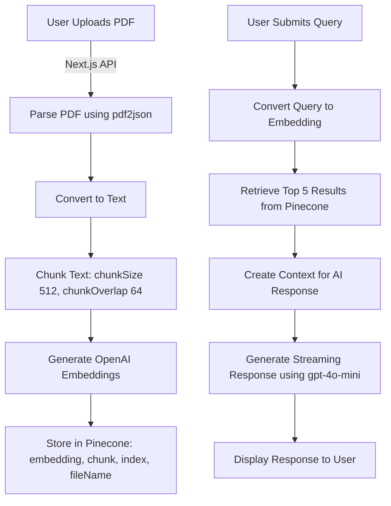

# AI-Powered Document Query System

This application allows users to upload PDFs, which are then processed, chunked, and stored in Pinecone for efficient retrieval using OpenAI embeddings. Users can query the stored data and receive AI-generated responses based on the most relevant document chunks.

## 📌 Features
- Upload PDFs via a Next.js portal.
- Parse and extract text using `pdf2json`.
- Chunk text with `chunkSize: 512` and `chunkOverlap: 64`.
- Generate embeddings and store them in Pinecone.
- Retrieve top results based on user queries.
- Generate responses using OpenAI’s `gpt-4o-mini`.

## 📜 Workflow



## 🛠 Technologies Used
- **Next.js** - API and frontend
- **pdf2json** - Parsing PDFs into text
- **Pinecone** - Vector database for storing embeddings
- **OpenAI Embeddings** - Transform text into vector representations
- **GPT-4o-mini** - AI model for generating responses

## 🚀 Getting Started
### 1️⃣ Clone the Repository
```sh
git clone https://github.com/your-repo/ai-document-query.git
cd ai-document-query
```

### 2️⃣ Install Dependencies
```sh
npm install
```

### 3️⃣ Run the Application
```sh
npm run dev
```

## 📢 Usage
1. Upload a PDF via the web portal.
2. The system processes and stores chunks in Pinecone.
3. Enter a query in the chat interface.
4. AI retrieves relevant content and generates a response.

## 🤝 Contributing
Feel free to open issues and submit pull requests to enhance the system.

## 📜 License
MIT License

---

This project helps organizations store and retrieve policy-related documents efficiently using AI-powered search!

